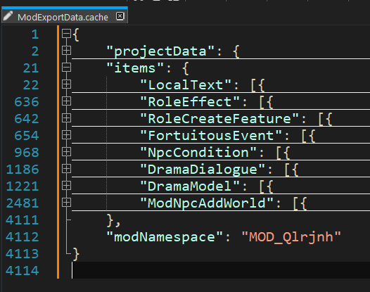
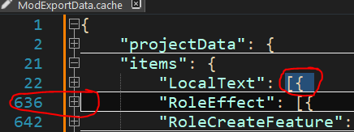

# 6. Source Reconstruction guide
The best (and least boring) way to learn how to do something, is by reverse engineering other people's work.

## Table of content
- [6. Source Reconstruction guide](#6-source-reconstruction-guide)
  - [Table of content](#table-of-content)
  - [6.1 ModExcel \& Mod Creator](#61-modexcel--mod-creator)
  - [6.2 ModCode](#62-modcode)

## 6.1 ModExcel & Mod Creator
A playable mod's ModExcel data-files are encrypted by default, while `ModExportData.cache` *(which contains the Mod Creator content)* is <ins>always</ins> encrypted.

As it's already been described in [1. Tools](./ModSummary.md#1-tools), the [Mod Decryption Tool](https://steamcommunity.com/sharedfiles/filedetails/?id=3225372871) is the key towards decrypting the data files. As the latest version of the tool no longer uses a perpetual per-frame listener, you **can** *(opposed to my Steam Workshop page's description)* have the tool actively loaded in your modlist. *(The only features which requires you to enter Debug Mode are the Json-dump buttons, otherwise you'll potentially be dumping ModExcel-patched Json-objects.)*

<ins>Data that reside in `ModExportData.cache` are non-recoverable to become readable for Mod Creator anymore!</ins> 
As an alternative the data can however be extracted into data files in json-format. This process looks as followed:
1. Open `ModExportData.cache` in Notepad++
2. *(Install JSTool for NPP if you haven't already, then)* hit Ctrl+Alt+M to beautify the json data.
3. Press Alt+0 to fold all code, then expand line 1 and expand `"items": {`
  Shown below is an example of what it would look like, using [this mod](https://steamcommunity.com/sharedfiles/filedetails/?id=2956998877).
  
4. From this overview: Create a new json file named after each of these item-keys. E.g. `LocalText.json`, `RoleEffect.json`, etc..
5. For each of the json files, select and copy the respective text, starting at the `[` and ending at the new line, see red-cicled screenshot example for the selection-start and selection-end:
  
6. Paste the copied text into the respective json file, repeat this process for every data-block in the cache file.

If the mod that you're source reconstructing has data in both `ModExcel` and the Mod Creator, I'd recommend making a sub-folder e.g. `ModExcel/ModCreator` to store the extracted json files.

## 6.2 ModCode
As described in [1. Tools](./ModSummary.md#1-tools), [ilSpy](https://github.com/icsharpcode/ILSpy) and [dnSpyEx](https://github.com/dnSpyEx/dnSpy) are required to reconstruct the code from a mod DLL, if the code hasn't been obfuscated.

...